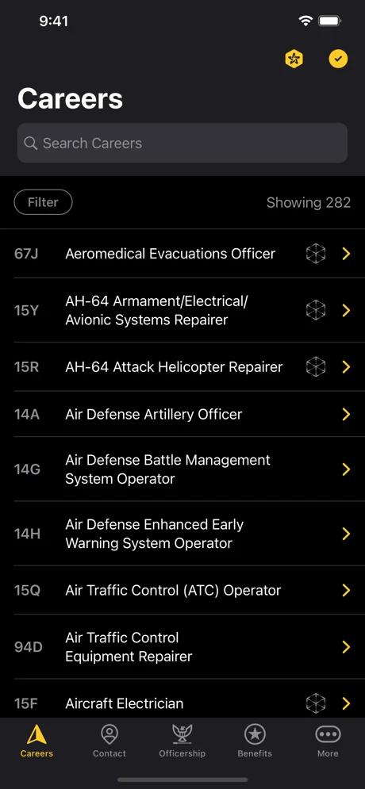
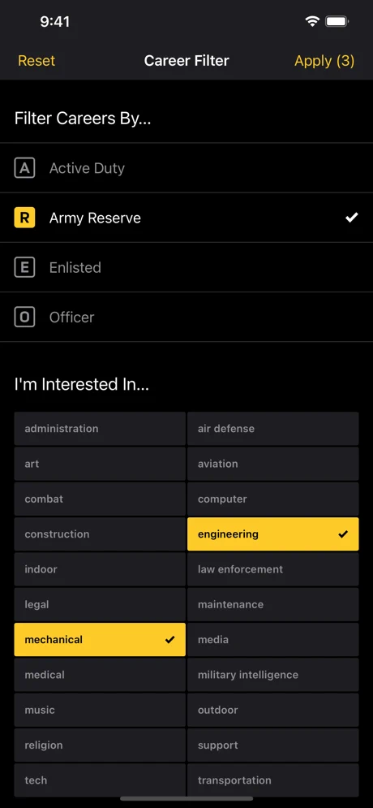
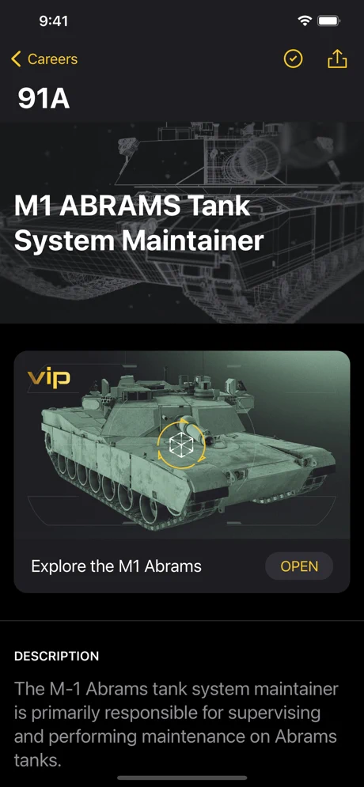
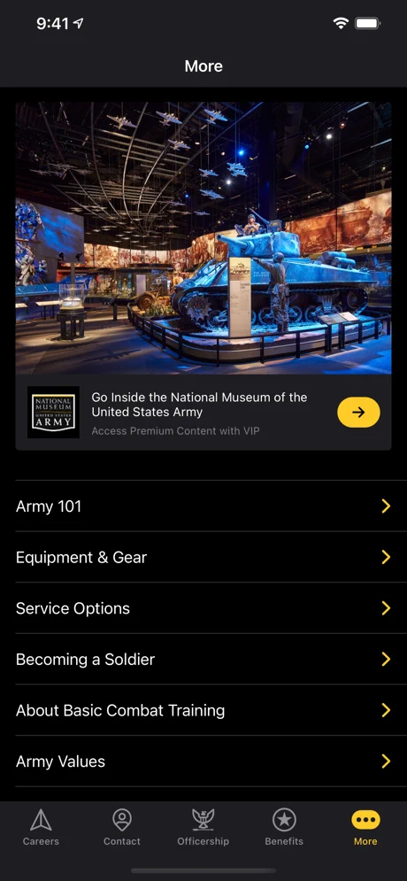
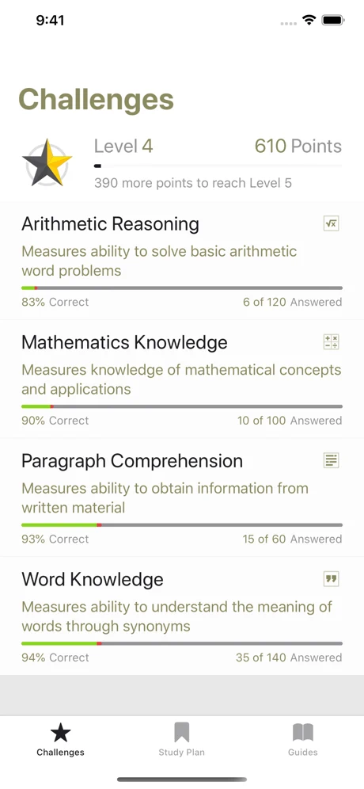
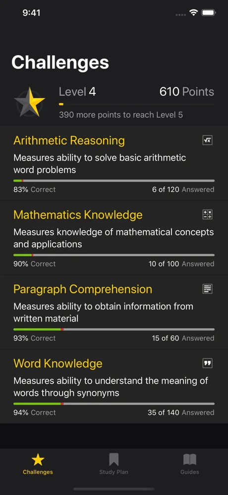
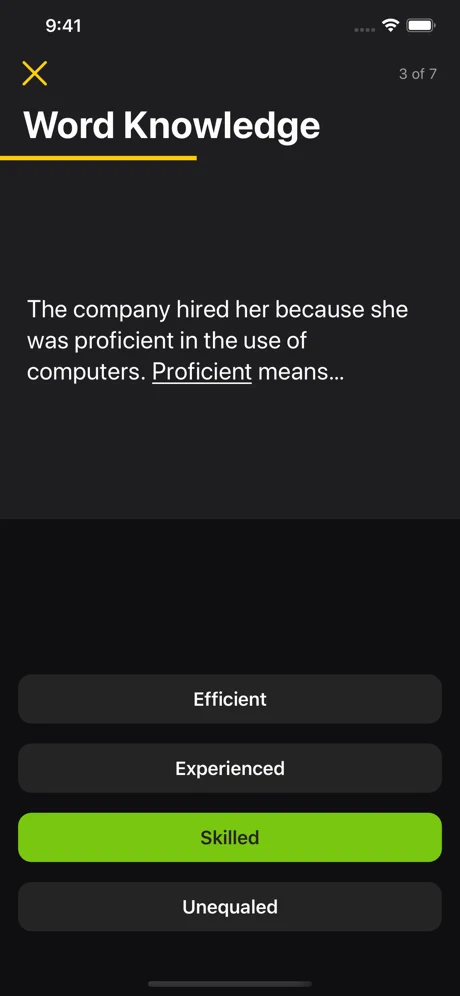
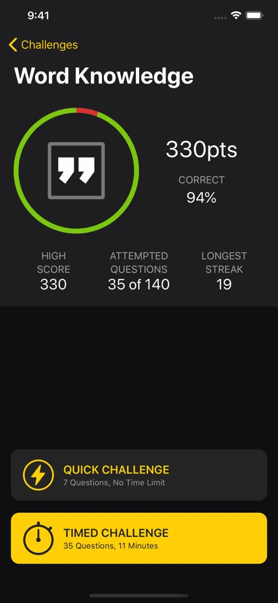

# Software Portfolio
Hi. 👋 I'm Travis, and this is my portfolio.

## Mobile Apps
This is a small sample of the mobile apps I've built – or lead teams that built. 

### U.S. Army Career Navigator 

[Career Navigator](https://apps.apple.com/us/app/u-s-army-career-navigator/id796509388?platform=iphone) is the U.S. Army's 
flagship career app. The purpose of Career Navigator is to allow folks interested in the Army to browse careers, educate 
them about what the Army has to offer, and to let them decide when the time is right to contact a recruiter.

   

I was involved in every phase of Career Navigator, from concept to delivery. My contributions included: writing almost 
every line of code for the iOS app, leading the mobile team, and product owner on the contractor side of the house.

```
Swift, Objective-C, Design, Augmented Reality, Rest API, Firebase, Google Analytics, Crashlytics
```

### U.S. Army ASVAB Challenge

[ASVAB Challenge](https://apps.apple.com/us/app/u-s-army-asvab-challenge/id1496772113?platform=iphone) is designed to 
help young people taking the ASVAB – and timed tests in general – get comfortable with the format of the test, 
understand the kinds of questions that will be asked, and master taking a test under time pressure. 

   

I was involved in every phase of ASVAB Challenge, from concept to delivery. My contributions included: writing every
line of code for the iOS app, leading the mobile team, and product owner on the contractor side of the house.

```
Swift, Design, Firebase, Google Analytics, Crashlytics
```


### Dam It, Beaver!
A fun, tongue in cheek game.
